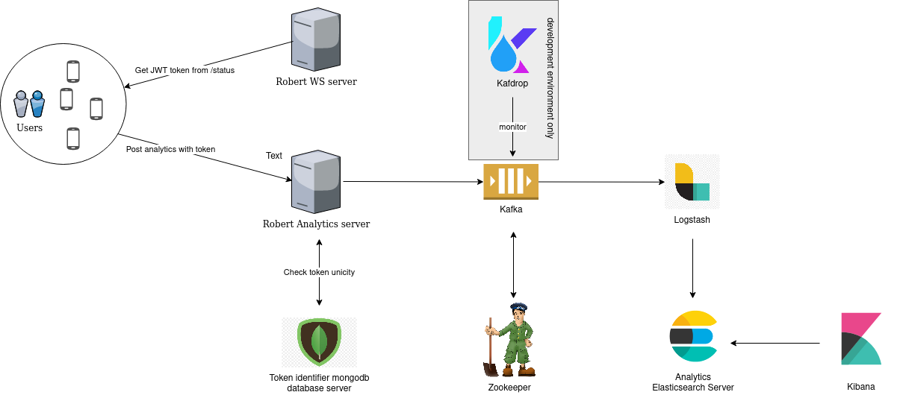

# Introduction

Ce projet gitlab.inria.fr est un des composants de la solution plus
globale [StopCovid](https://gitlab.inria.fr/stopcovid19/accueil/-/blob/master/README.md).

Ce composant gère la fonctionnalité appelée "analytics", c'est une fonctionnalité qui permet de recevoir de la part des
applications mobiles leurs statistiques d'usage (quel model de téléphone, quelle version d'OS, à quelle date a été
effectué le dernier status, la liste des erreurs rencontrées...)

# Architecture générale

L'application repose sur une application springboot en frontal. Celle-ci traite la requête provenant du terminal de
l'utilisateur final. Les principaux traitements effectués par cette application sont :

- validation du token JWT fourni par l'application robert, à noter qu'un token ne peut être utilisé qu'une unique fois
  pour soumettre des analytics. Une base de donnée mongodb est utilisée pour conserver la liste des tokens déjà
  utilisée.
- validation du contenu de la requête, on vérifie la structure de la requête vis à vis du contrat d'interface
- envoi des analytics dans un topic kafka.

Par la suite, le topic kafka est consommé par logstash qui repousse les analytics dans un elasticsearch. Les analytics
sont ensuite analysés grâce à un kibana.

note : le fichier source du diagramme est fourni [ici](analytics.drawio)

## contrat d'interface

le contrat d'interface du service rest exposé est disponible au format
openapi [anaylics_openapi](src/main/doc/openid_analytics.yml)

# Environment de développement

Si ce n'est déjà fait, se logguer, sur la registry docker de l'inria.

    docker login registry.gitlab.inria.fr

Pour fonctionner, cette application à besoin à minima :

- De mongodb
- De kafka

La stack complète d'outil tel que décrit dans le schéma d'architecture générale afin de manipuler les analytics qui
auront été stockés dans l'elasticsearch

Ces différents services sont disponibles dans un environnement docker lançable par :

    docker-compose -f ../environment-setup/dev/compose/docker-compose-analytics-server.yaml up -d

Les services dockerisés ne sont utilisés que pour pouvoir lancer l'application par elle-même. Les tests untaires
utilisent des services embarqués (embedded mongodb et kafka).

## Appel rest

Des appels rest peuvent être effectué sur l'application en utilisant la collection postman
fournie [postmail](src/main/doc/TAC-analytics.postman_collection.json)

## Spécificité de la configuration sous Windows 10

Dans le fichier etc/hosts (c:\windows\system32\drivers\etc\hosts) ajouter l'entrée suivante :

    127.0.0.1 docker-desktop

Dans l'application docker desktop settings, placer la quantité de mémoire à 10G.