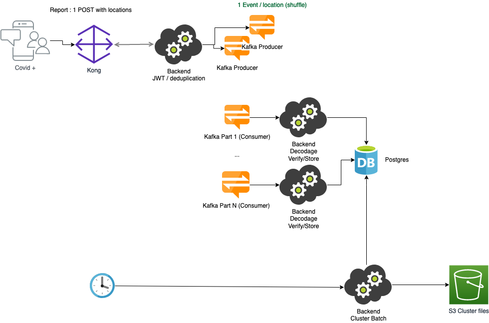

[[_TOC_]]

## What is Cléa ?
Cluster Exposure Verification (Cléa) is a protocol meant to warn the participants of a private event (e.g., wedding or private party) or the persons present in a commercial or public location (e.g., bar, restaurant, sport center, or train) that became a cluster because a certain number of people who were present at the same time have been tested COVID+.

It is based: (1) on a central server, under the responsibility of an authority (e.g., a health authority), that performs an automatic and centralized cluster detection; (2) on the display a QR code at the location, either in a dynamic manner (e.g., via a dedicated device, smartphone, or tablet) or static manner (e.g., printed); and (3) on a smartphone application used by people present at the location. This smartphone application enables to scan this QR code when entering the location, to store it locally (encrypted) for the next 14 days, and to perform periodic risk analyses, in a decentralized manner, after downloading information about the new clusters.

This protocol is also meant to be used by the location employees in order to warn them if their work place is qualified as cluster, or on the opposite to let them upload information to the server if they are tested COVID+.

This repository hosts a full implementation of the CLEA protocol.

For a full description of the CLEA protocol, see https://gitlab.inria.fr/stopcovid19/CLEA-exposure-verification

## Cléa Architecture



### Cléa crypto library
This component holds all the logic needed to encode and decode Cléa QR codes as described in the Cléa specification. It is composed of:
- a C encoder that will be used in embedded devices to generate and display dynamic QR codes,
- a JavaScript encoder that will be used to generate QR codes from a web browser,
- a Java decoder that will be used server-side.
There are also a Java encoder used for interoperability testing and a JavaScript decoder for quick checks.

This library is hosted at https://gitlab.inria.fr/stopcovid19/CLEA-exposure-verification/-/tree/master/CLEA-lib

### QR code generation web site
A web site is available for location managers to generate QR codes for their location.
It is available at https://qrcode.tousanticovid.gouv.fr/.
The web site is hosted in a dedicated repository. It uses Cléa crypto library component.

### Report web service
When a TousAntiCovid user is diagnosed Covid+, he/she can upload his/her visited locations while being contagious to the Cléa server to allow cluster detection based on the anonymous data. This information is very important to allow warning of people that were present at the same location and at the same time that he/she was exposed to a risk.

The [clea-ws-rest](clea-ws-rest) is the component that will receive records of infected visits. It will first check if it is a valid report, remove duplicated scans, and then send one message per infected visit that will be consumed by the [clea-venue-consumer](clea-venue-consumer) component.

The Clea venue consumer component is in charge of decoding a QR-code, checking its validity and then to compute the exposure time of the visit to save this information in the database. It uses the Java version of Cléa crypto library.

### Cluster identification and publication batch
At regular intervals, a cluster identification job is triggered to detect clusters from exposed visits registered in the server database. When clusters, if any, are identified, a list of clusters is generated and published so that TousAntiCovid (mobile) apps can check if their user have been exposed to a risk.
This component is hosted in the [clea-batch](clea-batch) folder.

### Scenarios in natural language
This implementation of Cléa also comes with end-to-end scenarios written in natural language allowing to easily express the expected behavior of the Cléa application.

Scenarios are written and executed with the [Cucumber](cucumber.io/) tool. They are hosted in the [scenarios](scenarios) folder.
To enable easy and fast end-to-end testing, 2 components have been written to mimick the behavior of:
- a TousAntiCovid mobile app, hosted in the [clea-client](clea-client) folder
- and a QR code generator allowing to simulate QR code generation for a given location. It is hosted in the [clea-qr-simulator](clea-qr-simulator) folder.

## Cléa coding guidelines

* Contributions are done through Merge Requests on the develop branch (gitflow). MR must be reviewed by another dev than
  the code author. a MR can be merged when approved by at least one reviewer.
* Development happens on feature branches.
* Commit often, small commits, and publish them on the central repositories to share the lastest developments with the
  dev team.
* Tests are run as part of the CI pipeline and should stay "green"
* Use Meaningful names (very important): classes, methods, variables
* Unit test the code
* Small methods
* Methods do one thing, only one level of abstraction
* DRY: Don't Repeat Yourself
* SOLID
    * S: Single-responsibility principle: a class should only have a single responsibility, that is, only changes to one
      part of the software's specification should be able to affect the specification of the class.
    * O: Open–closed principle: "software entities ... should be open for extension, but closed for modification."
    * L: Liskov substitution principle: "objects in a program should be replaceable with instances of their subtypes
      without altering the correctness of that program."
    * I: Interface segregation principle: "many client-specific interfaces are better than one general-purpose
      interface."
    * D: Dependency inversion principle: "depend upon abstractions, [not] concretions."
* Comments
    * Do not paraphrase the code. Make the code self-documentating.
    * Comment only what is not obvious by reading the code: informative comment, explanation of intent, warning. Use
      javadoc for public APIs.
* Formatting
    * Naming conventions: Camel case.
    * Unit of indentation is 4 spaces. No use of the tab character.
    * Curly braces at the end of the line that starts the class, method, loop, etc., and the closing brace is on a line
      by itself, lined up vertically with the start of the first line.

## Kafka SSL Setup
This section explains how to configure secure SSL communication between consumer/producer and kafka server.

We need to generate a certificate for our Kafka server (with CN = hostname). The certificate will be stored into a truststore (jks format) and protected by a password.

To generate a store in `jks` format, you can use the following instructions:

```sh
openssl pkcs12 -inkey node-1.pem -in node-1.pem -name node-1 -export -out node-1.p12
keytool -importkeystore -deststorepass changeme \
    -destkeystore node-1-keystore.jks -srckeystore node-1.p12 -srcstoretype PKCS12
```
Truststore has to be installed on the filesystem of servers hosting Kafka producers / consumers, i.e. clea-ws-rest and clea-venue-consumer apps.

Kafka SSL configuration will be stored in Vault and injected through spring-cloud-vault-config-consul in apps.
Here are the properties to inject into Kafka producers and consumers apps:
- `spring.kafka.bootstrap-servers` has to be set to the hostname:port of the kafka server (same name as the CN of the certificate)
- `spring.kafka.properties.security.protocol` with value `ssl` to enable SSL
- `spring.kafka.ssl.trust-store-location` with value `file:///path/to/kafka.client.truststore.jks` (do not forget the `file://` prefix for a valid URL)
- `spring.kafka.ssl.trust-store-password` 
