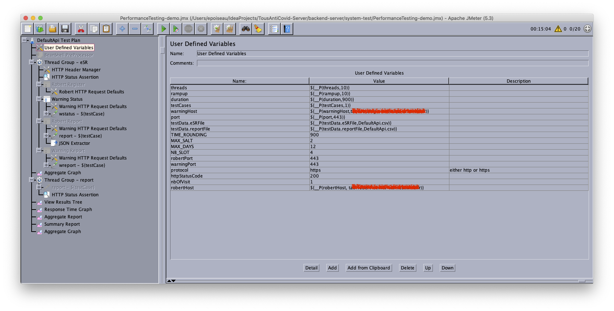
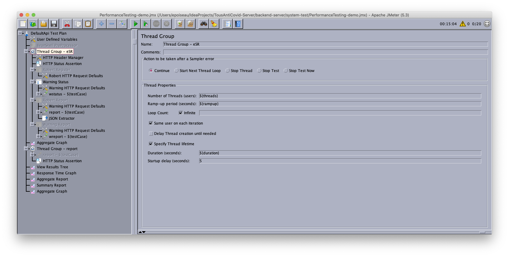
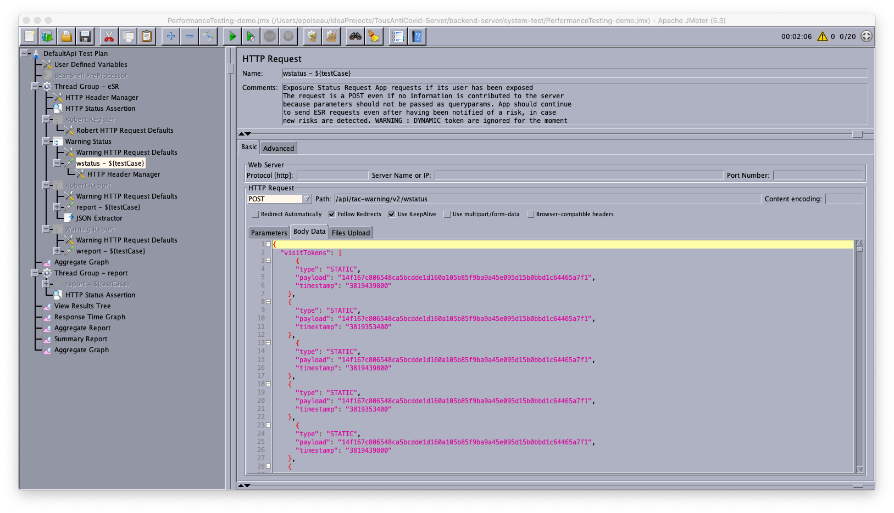
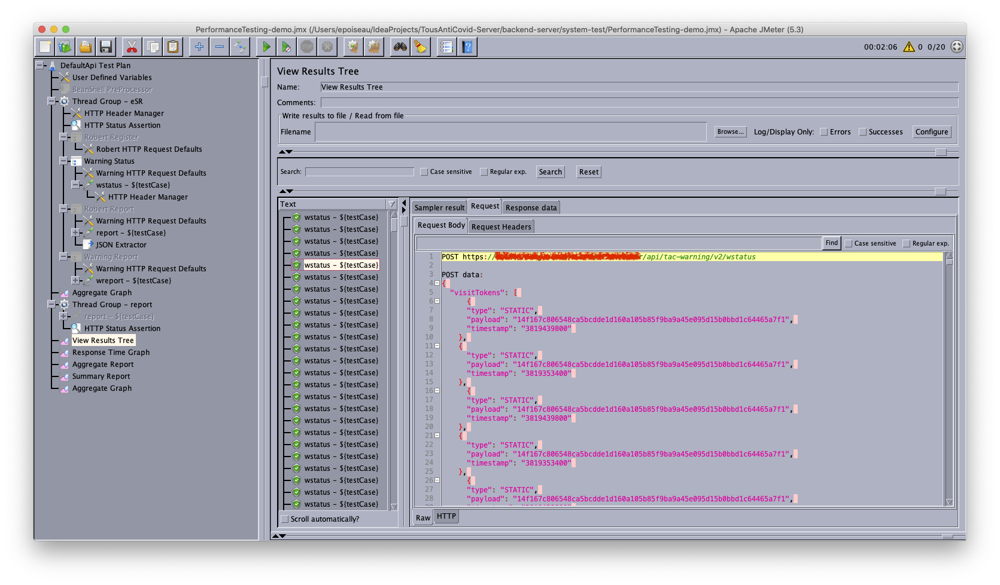
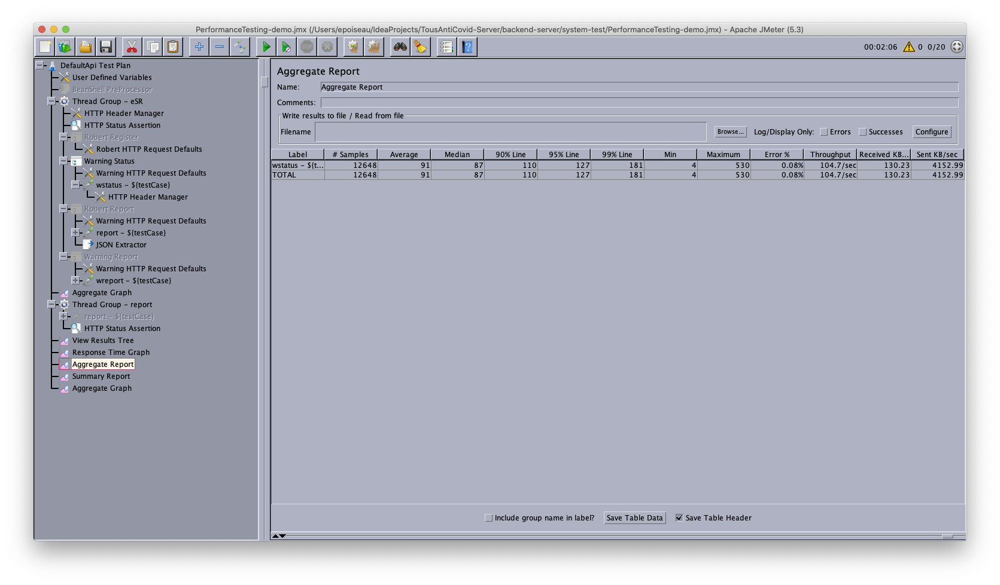

End 2 End System tests

Objective being to create End to End scenarios for testing the backend through the web api.

The test can run either on a locally deployed backend or on the test/prod servers.

Test scenario are in `/src/test/resources` in cucumber format.


## Prerequisite
The project cannot work independently of the backend sources. Indeed the client api is generated from 
the openapi definitions of TAC-Warning and Robert-Server. Thus the pom expects to find 
openapi.yaml files for both projects are they are on the gitlab. 

## Run

Copy the `config-template.properties` to `config.properties`
Optionnaly, adapt it in order to point to the target endpoints. (default is localhost)

Compile and launch tests:

```
mvn verify
```
## Performance testing 
We use jmeter in order to perform load testing. 
Jmeter can be downloaded from https://jmeter.apache.org/
Once jmeter is started, load the sample project from this project (file PerformanceTesting.jmx)


In the section "User defined variables" adjust entries in order to select target system.
- warningHost contains the IP or hostname for the tac-warning micro services
- robertHost constains the IP or hostname for the robert microservices
- protocol shall be set to http or https depending on context
- robertPort and warningPort can be set independently. If using https please use 443

-threads, rampup, duration and testcases can be set to specify the load to exercise on the tested system. See section "Thread Group - eSR" 
for the load testing adjustment.


### Customization of messages
The different test steps can be enabled or disabled. 
The content of the message send to the microservice can be customized from the GUI. See the screen capture for the wstatus exemple below.


For instance, if one wants to increase the number of tokens to send in the wstatus messages, this is where one should adapt the content. 

### Test outcome 
Once the test is started, statistics about the test outcome can be visualised from the "Thread Group "




