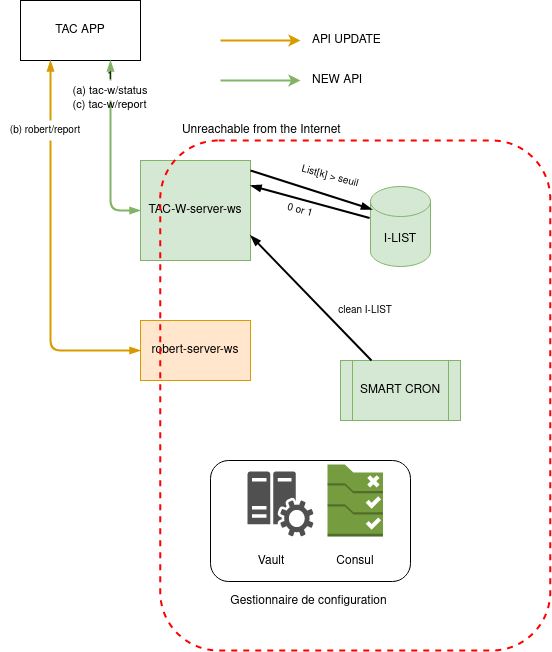

# Spécifications TAC Warning

## Glossaire

- TAC : TousAntiCovid. Application mobile de tracing, envoie des notifications aux cas contacts, i.e., aux personnes ayant été a proximité pendant 15 min d’une autre personnes qui se déclare positive à la covid par la suite  
- TAC-W : TAC-WARNING. Protocole permettant d’alerter les personnes qui ont fréquenté un lieu clos, à une date donnée, sur une plage horaire données, alors que d’autres personnes y étaient aussi et se sont déclarées positive à la covid après. 
- TAC-Wpro : Application mobile pour un professionnel d’un lieu accueillant du public pour générer des QR-CODE de type dynamique.
- TAC-W-QR-SERVER : Application web permettant de générer des QR-CODE pour TAC-WARNING de type statique à imprimer. 
- OTP : One Time Password
- TERMINAL : l’appareil utilisé pour présenter le QR-CODE à scanner au CLIENT. Ce peut-être un téléphone, une tablette ou tout autre terminal électronique avec un écran et permettant la présentation du QR CODE au CLIENT.  
- LIEU CLOS  (*venue*): le lieu accueillant le public, qu’il soit public ou privé, restaurant, salle de spectacle
RESPONSABLE : Suivant le type de lieu clos, ce peut être le restaurateur, l’organisateur du rassemblement...

## Remarques préliminaires

Le but est d’avoir une solution permettant de détecter les clusters
potentiels dans les lieux clos rassemblant du public : ERP comme un
restaurant, un bar ou des lieux privés clos employés lors d’un mariages,
fêtes... Le but est donc de collecter une information sur la fréquentation
d’un lieu à une date et plage horaire donnée. Si des personnes ayant
fréquentées ce lieu se déclarent positives à la covid, les autres personnes
présentent seront informées.

Cette note illustre le protocole en utilisant comme exemple un restaurant.

Le protocole doit cohabiter avec TAC-Warning DYNAMIQUE (non encore spécifié).

Le protocole fonctionne comme suit :

Le restaurateur doit afficher, ou mettre à disposition un QR-CODE à ses
clients. Ce QR code doit être le même pour tous les clients présents sur une
plage horaire déterminée (par exemple à chaque service). IlL est conseillé de
changer de QR code au moins tous les jours et si possible entre les services.
Le client est équipé de l’application TAC-W. Lorsqu’il rentre dans le
restaurant, lorsqu’il s’installe, lorsqu’il consulte le menu ou lorsqu’il
paye, il scanne le QR-code mis à disposition par le restaurateur. Le QR code
contient comme information :

- Le type du QR-CODE : STATIC/DYNAMIC  
- le type et la classe de l’ERP (cf https://www.service-public.fr/professionnels-entreprises/vosdroits/F32351)
- la jauge de l’ERP
- un UUID aléatoire et unique

et TAC-W rajoute un time stamp (plage horaire avec une précision à fixer)

TAC-W envoie régulièrement des requêtes qui contiennent les QR-codes
collectés lors des x derniers jours (dans le
config.json, paramétrable : par défaut 14 jours) avec leur timestamp. Le backend vérifie alors si
un de ces QR-codes fait partie des QR-codes exposés (même UUID et même plage
horaire recouvrante. Dans ce cas, l’utilisateur reçoit un warning. Ces
requêtes sont anonymes et « state-less » (i.e. si l’app part en timeout et
retry seulement 1 jour plus tard, le warning aura toujours la même valeur).
et anonymes.

Lorsqu’un utilisateur est déclaré positif au COVID, il télécharge la liste
des codes QR qu’il a collectés durant les x derniers jours avec leur
timestamp. Le serveur backend tient à jour la liste des QR-codes exposés.

Important : l’ERP ne collecte aucune donnée, et notamment aucune donnée personnelle ou sensible. 

## Description de TAC Warning

### Configuration

Le restaurateur imprime des QR-code émis par un serveur web. Les informations
encodées dans le QR-CODE sont codées en json :

```
{
"type" : STATIC ou DYNAMIQUE,
 "venueCategory" : 1 à 5 (Catégories d'ERP en fonction de la capacité d'accueil, y compris le personnel. On peut affiner les petites capacités : moins de 20, ente 21 et 50, entre 51 e 100, 101-200, 201-300),
 "venueType" : ENUM Lettre (et on pourra ajouter lieu clos privés)
 “capacity” : capacité du lieu en # de personnes 
 "uuid" : code aléatoire unique UUID 64
}
```

Tous les champs sont facultatifs sauf le champ `venueType` (et l'UUID, mais ce dernier est systématiquement fourni par le générateur)

Il est recommandé de lui demander les dates où il souhaite mettre à
dispositions les QR-CODE et de donner cette date lisible sous le QR-CODE.

QUESTION : doit-on mettre dans le QR-code une date de péremption ? Peut être
optionnelle. Mais si présente, est checkée par l’application TAC-w à la
lecture du QR-code.

Le restaurateur peut aussi télécharger TAC-Wpro, choisir le type de QR-CODE
Static, et TAC-Wpro affichera un QRcode. Il doit y avoir un moyen de changer
de QRcode après confirmation.

L’utilisateur client télécharge TAC-W mais n’a pas besoin de s’enregistrer
pour utiliser le service. Le seul enregistrement est fait dans TAC, est
indépendant et employé uniquement à l’upload quand l'utilisateur souhaite se
déclarer positif. Par conséquent, le back-end n’enregistre aucune information
concernant les utilisateurs en lien avec ce service TAC-W.

### Operations de TAC-Wrpro (application du restaurateur)

De base, les QR-code sont émis par un site web. 
Si le restaurateur le souhaite, il peut employer TAC-Wpro :
Configurer l'application en mode QR-Statique
Initialiser les quelques paramètres (catégorie, type…)
Ou flasher un QR-code déjà émis pour recopier de ce dernier dans son application
Présenter le QR-code aux clients 

Quand un terminal TAC-Wpro en mode réplication esclave recopie un QR- code à l'initialisation il ne peut pas en générer d'autres. Il est lié au qr-code du terminal TAC-Wpro principal (pour éviter d’avoir des qr-code différents pour le même lieu. ex: un responsable de salle ave terminal principal et plusieurs serveurs avec chacun un terminal en mode réplication). 

Il est recommandé de générer d'autres QR-code. Soit de façon automatique en pré-programmant les heures de changement, soit de façon manuelle. Si d'autres terminaux (réplicats) ont été initialisés à partir de celui cio il faut re-déclencher la manipulation de réplication. 

### Operations de TAC-W (application du client)

#### QR code scanning

Quand le client rentre dans un restaurant, il scanne avec TAC-W le code QR courant, QR qui lui est présenté par le restaurateur, et le stocke avec un timestamp (secondes NTP) arrondi à S secondes (timestamp=NOW - (NOW % S)) l'heure dans une liste locale localList pendant x (x=12?) jours (x étant défini dans le config.json, et par défaut à 14 jours).

#### Déclaration d'utilisateur infecté

Si le client est testé positif, il utilise TAC pour se déclarer. En même temps qu'il upload ses contacts, il télécharge sa liste localList sur le backend TAC-W  

À la déclaration (`/report`) dans TAC, le client reçoit un token JWT qu'il utilisera 
ensuite pour remonter ses visites à TAC-W.


pour chaque élément {timestamp, QRcode} de cette liste localList, le backend:
1. Regarde si le type du QRcode est dynamique, il le passe au module TAC-W-DYNAMIQUE
3. Calcule alors les tokens possibles et stocke dans sa liste exposedList
  - SHA256(i|uuid) pour i=1 à max (notez les bornes : 1 à max_salt inclus)
  - `visitStartTime` et `visitEndTime` correspondant au début et à la fin de la visite de l'utilisateur infecté (estimation / valeur forfaitaire qui dépend notamment du type d'établissement)
  - `startDelta` et `endDelta` (secondes à retrancher et à ajouter à un timestamp remonté lors d'une requête status pour trouver l'intervalle de visite correspondant -- également une estimation dépendant notamment du type d'établissement)
  - un compteur dont la valeur est notamment fonction du nombre de personnes positives dans l'intervalle considéré et du type d'établissement.


#### Status Request

Régulièrement le client envoie une requête au backend TAC-W qui contient les tokens de sa liste localList qu'il a collecté les x derniers jours. Ces requêtes sont stateless et anonymes.
Le token est défini par token=SHA256(salt|uuid), ou uuid est récupéré du QR code, salt est un valeur aléatoire de 1 à max (max=1000?) choisie par l'app. du client et time est le temps NTP arrondi à S secondes.

Pour chaque token de cette requête, le backend:
1. Regarde si le type du QRcode est dynamique, il le passe au module TAC-W-DYNAMIQUE
2. Pour chaque token dans la base dont la valeur est identique au token soumis, on sélectionne ceux qui ont une intersection non vide avec l'intevalle de visite correspondant à la requête (dérivé du timestamp, de de `startDelta` et `endDelta`) et on somme leurs compteurs d'exposition
3. Si la somme dépasse un seuil défini, l'utilisateur est alerté

## Fonctionnement du serveur

### Modèle SGBD
Le modèle de SGBD est postgreSQL. Les records sont fixes en format.
Peu d'écriture. Il n'est remonté que quelques centaines à quelques milliers de report par jour, les seuls qui impliquent des écritures en base. Les statuts n'induisant que des lectures. 


### Service web

Les tâches réalisées par le webservice =
A la réception d’une requête status `/status`:

voir la partie "status request" ci-dessus

A la réception d’une requête TACW_REPORT upload V1/tacw/report:
1. Extraire de la réponse du POST au serveur Robert le JWT.
2. Vérifier que le JWT est valide. (définir la durée de validité du JWT e timestamp_émission + 1h ? )
  - Si KO exit avec ERROR CODE correspondant à l’erreur rencontrée:
    - ERROR_JWT_EXPIRED
    - ERROR_JWT_SIGNATURE_INVALID
3. Traiter les tokens en mode non prioritaire (voir partie "déclaration d'un utilisateur infecté" ci-dessus)
Définir la liste des codes d’erreur possibles


Purge de la table :
Exécuter une tâche asynchrone (cron) pour purger les entrées dans Infected-List dont la date d'expiration a expirée. 


## Module d'initialisation des données des ERP
On doit pouvoir changer à la volée les heures avant / après d'un ERP: https://www.service-public.fr/professionnels-entreprises/vosdroits/F32351

(Pour l'instant, une modification affectera uniquement les visites postérieures)

## Analyse

(https://github.com/CrowdNotifier/documents/blob/main/CrowdNotifier%20-%20White%20Paper.pdf)

Non-functional requirements

NF1: Ease of use for users. To ensure adoption, the system should be easy to use from a user’s perspective. And in particular no more complicated than base-line paper-based solutions.

NF2: Easy deployment for locations. To ensure adoption of the system in a large number of locations, the system should not require (special) hardware at locations or server infrastructure managed by locations.

NF3: Speed of notification. 

NF4: Small bandwidth and computation requirements. The system should have a small bandwidth and computation requirement on the side of the user.


Security/Privacy requirements

Privacy of users

PU1: No central collection of personal data. The presence-tracing system should not require the central collection of personal data (e.g., name, IP-address, e-mail address, telephone number, locations visited) of people that visit a location. 

PAC-W-STATIC does not collect any personal data about users. 
 
The location is linked to the QR-CODE but the status request and the upload request are fully stateless, so decorrelated of any personal information. On the backend, the IP-address is not collected nor treated thanks to deep packet cleaning after a proxy server.

Nor should the system be able to infer location or co-location data of either visitors or notified visitors. For the purpose of presence tracing, the health authority is allowed to learn which locations a SARS-CoV-2-positive person visited.

Since the connection to the back end is stateless, no inference can be done. The backend only records the number of people, declared positive to COVID19 that where present at a given place during a given period of time. 

PU2: No collection of personal data at a location. The system should not require collecting at the location itself personal data (e.g., name, e-mail address, telephone number) of people that visited that location. The sole exception to this is the paper-based fall-back
approach.

The location is not collecting any data in PAC-W.


PU3: No location confirmation attacks given phone. The system should hide which locations somebody has visited. PU1 and PU2 imply that this information should not be available centrally or at the location itself. This information should not be available to attackers that have access to the phone. In particular:
- The UI should not reveal which locations the user visited (e.g., to prevent (retroactive) location tracking by intimate partners and law enforcement).
- The data stored on the phone should not reveal or enable confirmation of visited locations to determined attackers (e.g., law enforcement). Such attackers can gain access to internal storage (i.e., information stored internally by the app), and can also be assumed to have visited specific locations.

The data that are stored on the user’s device is encrypted.

However the server can identify the ID_ERP of the visited locations which could reveal the location of the restaurant (all depend on how the ID_ERP is generated).


Confidentiality of locations

PL1: Hide which locations had a SARS-CoV-2-positive case from non-visitors. Attackers that never visited a location, should not be able to determine whether that location had a SARS-CoV-2-positive case.

Without a valid QR code from the location, the attackers can’t learn anything about the location. 

PL2: Hide which locations had a SARS-CoV-2-positive case from non-contemporal visitors. An attacker that visited a location, but not during the time when a SARS-CoV-2-positive person was present, should not be able to determine whether that location had a SARS-CoV-2-positive case.

Without a valid QR code from the location generated during the “contagious” period, the attackers can’t learn anything about the location. 

PL3: No new central database of locations/events. The system does not create (or rely on) a central database capturing information about all locations. This avoids creating a new database with events (e.g., political and religious gatherings) for the purpose of presence
tracing.
Corollary: this requirement also implies that organizers and owners should be able to produce the QR codes anonymously (e.g., using the Tor browser).


Security

S1: No fake notifications (targeting of users). The system should make it impossible to target specific individuals, thereby causing them to be quarantined

Targeting users is not possible unless the attacks follows the target and obtains valid QR codes for the visit period.


S2: No population control (targeting of locations). The system should make it impossible to target sensitive locations (gay bar, biker hangout, bars/places-of-worship in specific neighbourhoods, etc.), thereby causing all the visitors to be quarantined.
Inherent limitation. If an infected person deliberately visits sensitive locations, the functional requirements imply that visitors of this location must be notified. So, at best, we can protect against people that did not visit a location.

Targeting locations is impossible unless the attackers visit the place to get valid QR codes in the interval [h-1;h+1] of the target victim.

## Schéma d'architecture



## Infrastructure

Mise à jour des environnements de DEV, INT, Pré-PROD et PROD

Pour chacun de ces environnements, il est envisagé la mise en place de :

Applicatifs en java 8
TAC-W-server-ws, accessible par l'application mobile TAC
Expose l'API /status et /report
On modifie /report

Une base de données postgreSQL pour la gestion des QR-CODES-ERP de type statique remontés (voir partie "déclaration d'un utilisateur infecté" pour des précisions sur le format)

Architecture Vault pour y stocker les credentials d’accès à la base de données

Dimensionnement :
N : nombre d'applications TAC (20 Millions)
R : nombre d'ERP visités par jour (10 à 100)

## Volumétrie

Voir [le document correspondant](volume.md)

## API Robert

Voir la [description OpenAPI](../../robert-server/robert-client-api-spec/openapi.yaml)

## API TACW

Voir la [description OpenAPI](openapi.yaml)


## Diagramme de séquence
